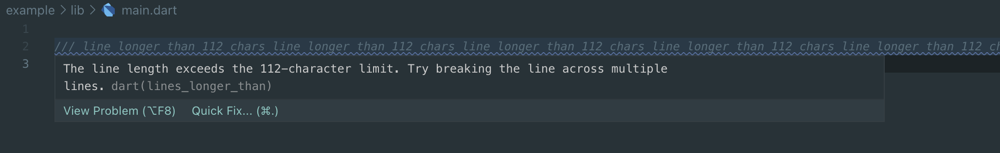

## Features

Lines longer than - the package provides a configurable lint similar to line_longer_than_80_chars. 
With this package you can set any line length for analyzer.

## Usage

### analysis_options.yaml

```yaml
custom_lint:
  rules:
    - lines_longer_than:
      chars_limit: 112

analyzer:
  plugins:
    - custom_lint
```

#### pubspec.yaml

```yaml
dependencies:
  flutter:
    sdk: flutter
  custom_lint: ^0.5.0

dev_dependencies:
  flutter_test:
    sdk: flutter
  lines_longer_than: ^1.0.0

```
## Example

<div align="center">

</div>

## Additional information

The package base on [custom_lint](https://pub.dev/packages/custom_lint).


Unfortunately, running dart analyze does not support newly defined lints. We need a separate command for this ```dart run custom_lint>```


